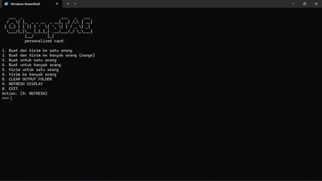

# Personalized Card OlympIAE 2025

Mengotomatiskan pembuatan kartu personalisasi untuk peserta OlympIAE 2025, yang mencakup beberapa tahapan penting:

1.  **Pengumpulan dan Pemrosesan Data**:
    * Data peserta diambil dari file Excel, termasuk informasi pribadi, statistik kegiatan, dan status penyelesaian.
    * Data diproses untuk menghasilkan berbagai grafik dan statistik, seperti proporsi penyelesaian, distribusi usia, dan performa individu.
2.  **Pembuatan Grafik dan Statistik**:
    * Berbagai grafik dibuat menggunakan `matplotlib` dan `seaborn`, termasuk:
        * Scatter plot (usia vs. elevasi, usia vs. waktu tempuh, kecepatan vs. detak jantung).
        * Bar plot (proporsi penyelesaian, distribusi penyelesaian per tahun, jarak tempuh per tanggal).
        * Kurva jarak kumulatif.
    * Statistik individu dan kelompok dihitung dan disimpan dalam file teks.
3.  **Pembuatan Kartu Personalisasi**:
    * Presentasi PowerPoint dibuat menggunakan `python-pptx`, menggabungkan grafik, statistik, dan informasi pribadi peserta.
    * Presentasi dikonversi ke PDF menggunakan `comtypes`.
4.  **Kompresi dan Pengiriman**:
    * Folder yang berisi kartu personalisasi (PDF dan grafik) dikompresi ke dalam file ZIP.
    * File ZIP dikirimkan ke peserta melalui WhatsApp menggunakan `pyautogui`.
5.  **Otomatisasi**:
    * Seluruh proses diotomatiskan menggunakan `pyautogui` untuk mengontrol mouse dan keyboard, memungkinkan pembuatan kartu dan pengiriman ke peserta melalui Whatsapp.

## *Library* yang digunakan

* **Pengolahan Data**: `pandas`, `numpy`
* **Visualisasi Data**: `matplotlib`, `seaborn`
* **Pembuatan Presentasi**: `python-pptx`
* **Konversi PDF**: `comtypes`
* **Otomatisasi GUI**: `pyautogui`
* **Kompresi File**: `shutil`
* **Pengiriman WhatsApp**: `pyautogui`

## Alur Kerja

1.  Pengguna memilih mode (satu atau banyak peserta).
2.  Data peserta diambil dan diproses.
3.  Grafik dan statistik dihasilkan.
4.  Kartu personalisasi (PPT dan PDF) dibuat.
5.  File ZIP dibuat dan dikirim melalui WhatsApp.


## Catatan

* Koordinat mouse dan waktu tunggu mungkin perlu disesuaikan tergantung pada sistem dan tata letak WhatsApp.
* Perubahan tata letak WhatsApp dapat mempengaruhi fungsi otomatisasi.
* Penanganan error dan validasi input dapat ditingkatkan untuk robustness yang lebih baik.

## *Input data*

### Load excel ke Database
jalankan `./import_database.bat`. Pastikan bahwa anda sudah memiliki `postgre sql`.

### Skema Database


### Contoh Isi Tabel
***tabel*** : *Podium*


***tabel*** : *detail activity*


silakan update file `input_data.xlsx` pada folder `./input`.

## *Output data*

Dihasilkan sebuah file `.zip`  pada folder `./output/`.

Contoh isi file zip :


Isi Folder data :


## Struktur Program


## Cara menjalankan

```bash
python ./main.py
```

## Demo Program

<!--  -->


## *Caveat*
1. Untuk memastikan proses otomasi berhasil (utamanya pada bagian mengirim pesan ke Whatsapp), pastikan bahwa ketika `alt + tab` maka tab yang paling depan muncul adalah Whatsapp (terbuka dalam mode _full screen_).
2. Apabila ada kesalahan perilaku sistem (utamanya saat proses pengiriman ke Whatsapp), **SEGERA PINDAHKAN KURSOR KE POJOK KIRI ATAS MONITOR**. Maka program akan berhenti (*FAIL SAFE*).
